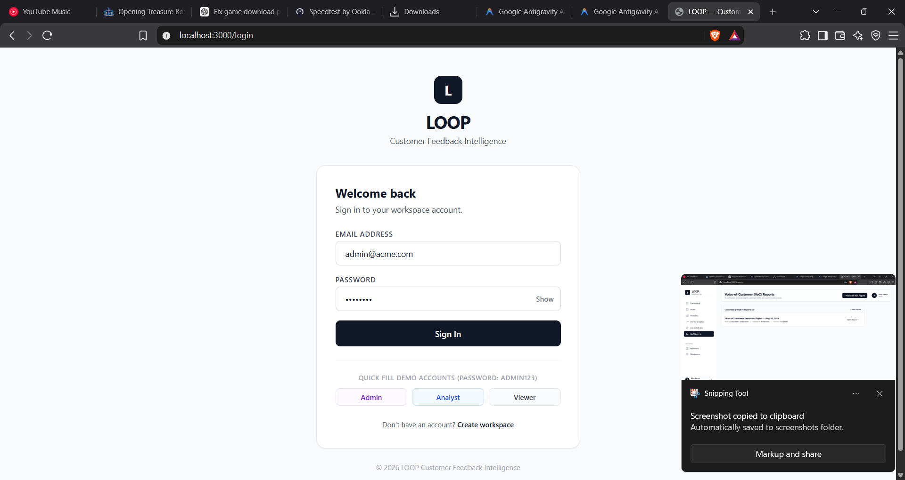
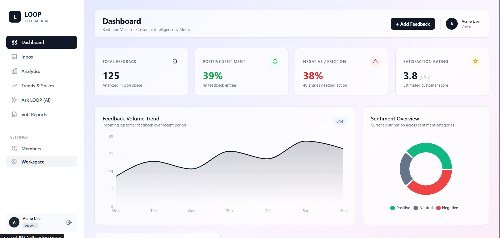
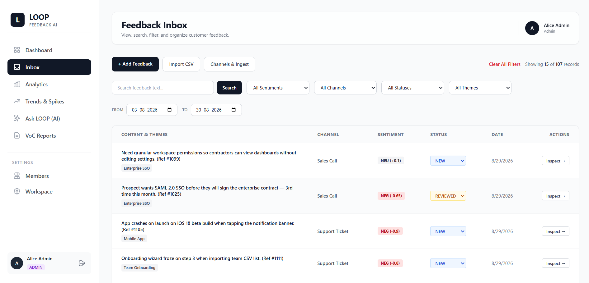
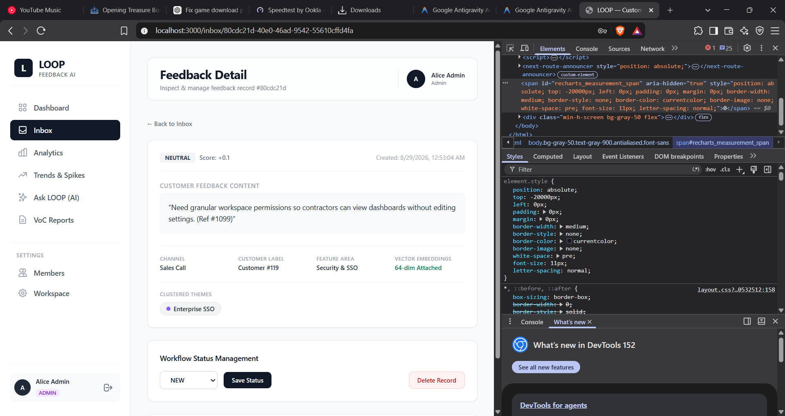
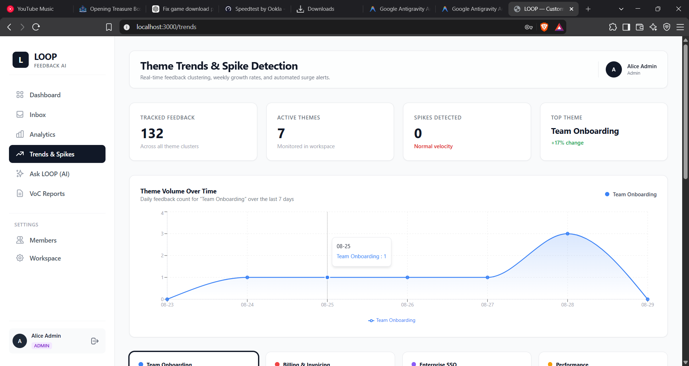
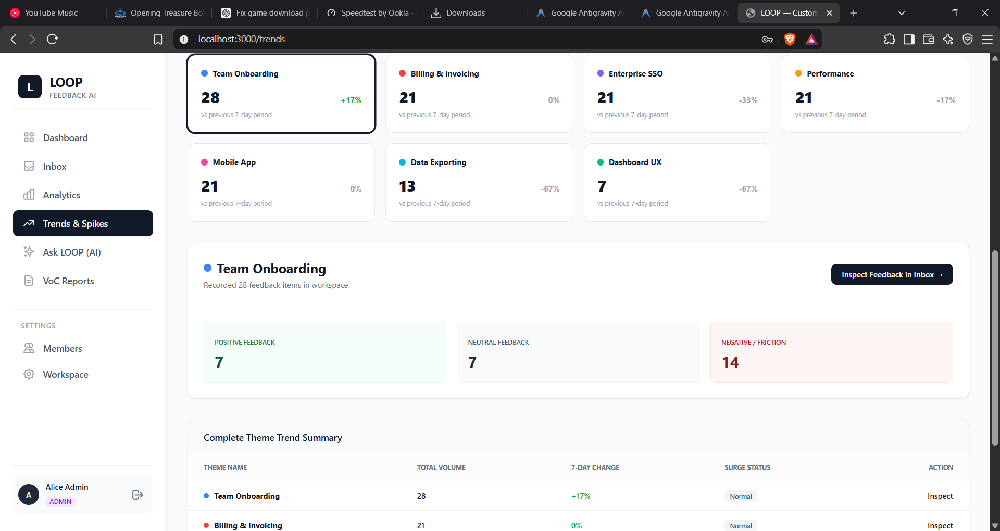
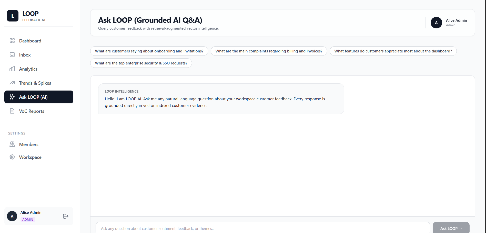
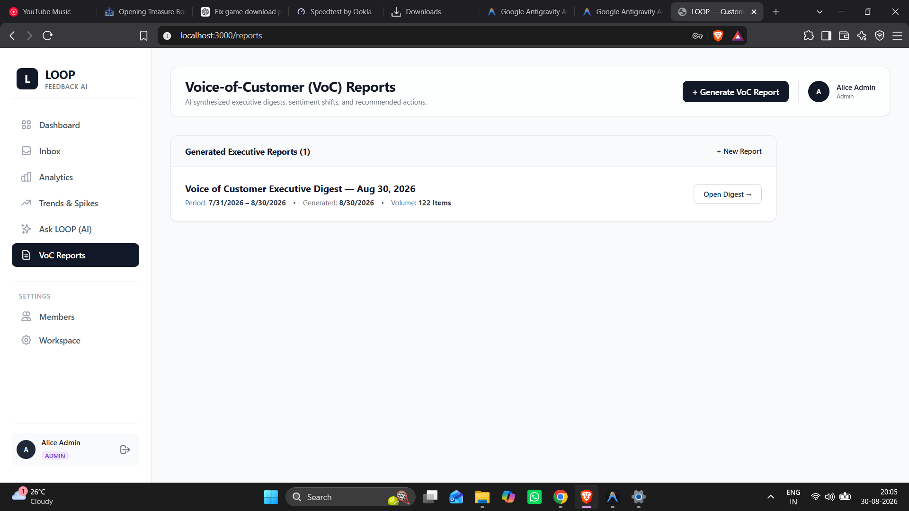
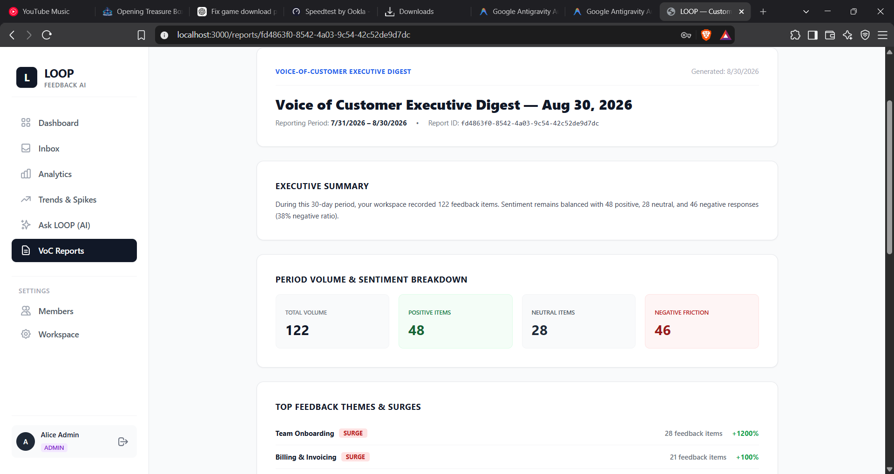

# LOOP — AI Customer-Feedback Intelligence Platform

> Turns scattered customer feedback into a ranked, evidence-backed list of what to do next.

---

## 2. Screenshots


*Figure 1: Authentication screen with workspace role-based credentials.*


*Figure 2: Real-time analytics dashboard with volume trends, sentiment breakdown, and spike alerts.*


*Figure 3: Multi-channel feedback inbox supporting date range, channel, sentiment, and theme filters.*


*Figure 4: Detailed view showing extracted sentiment score, feature area, assigned themes, and vector embedding.*


*Figure 5: Time-series area chart displaying theme volume growth over time.*


*Figure 6: Granular theme volume tracking, percentage change, and surge status overview.*


*Figure 7: Retrieval-Augmented Generation (RAG) assistant answering questions with cited feedback evidence.*


*Figure 8: Generated Voice-of-Customer executive digests archive with period stats.*


*Figure 9: Detailed executive report narrative with key statistics, verbatim quotes, and action recommendations.*

---

## 3. Tech Stack

| Layer | Technology | Description |
| :--- | :--- | :--- |
| **Web Framework** | [Next.js 14.2](https://nextjs.org/) (App Router) | React Server Components, client pages, and serverless API route handlers |
| **Language** | [TypeScript 5.6](https://www.typescriptlang.org/) | End-to-end type safety across the database, AI handlers, and UI |
| **Styling** | [Tailwind CSS 3.4](https://tailwindcss.com/) + [clsx](https://github.com/lukeed/clsx) + [tailwind-merge](https://github.com/dcastil/tailwind-merge) | Responsive design system with custom utility styling |
| **Database** | [PostgreSQL (Supabase)](https://supabase.com/) | Relational database engine with pooled and direct connection strings |
| **ORM** | [Prisma ORM 5.22](https://www.prisma.io/) | Schema definition, relational joins, and database queries |
| **Authentication** | [NextAuth.js 4.24](https://next-auth.js.org/) + [bcryptjs](https://github.com/dcodeIO/bcrypt.js) | JWT session management, route protection middleware, and RBAC |
| **AI Engine** | [Anthropic Claude 3.5 Sonnet](https://www.anthropic.com/) (`@anthropic-ai/sdk`) | Structured classification, executive report synthesis, and grounded Q&A |
| **Vector Search / Embeddings** | 64-Dimensional Vector Hashes (`lib/ai/rag.ts`) | Cosine similarity matching for semantic feedback retrieval |
| **Charts & Visualizations** | [Recharts 2.13](https://recharts.org/) | Interactive area charts, daily volume bars, and sentiment pie graphs |
| **Validation** | [Zod 3.23](https://zod.dev/) | Strict runtime request and response payload schema validation |
| **Deployment Target** | [Vercel](https://vercel.com/) | Cloud platform for serverless Next.js deployments |

---

## 4. Features

### Core Platform Features
- **Multi-Tenant Workspaces & RBAC**: Strict tenant isolation across all database operations with role-based access control (`ADMIN`, `ANALYST`, and `VIEWER`) enforced via API route guards and Next.js middleware.
- **Multi-Channel Feedback Ingestion**: Captures customer feedback through direct manual submission, bulk CSV uploads with client validation, and simulated streaming channels (Support Tickets, App Store, NPS Surveys, Sales Calls, Community Posts).
- **Feedback Inbox & Management**: Comprehensive search, pagination, multi-attribute filtering (date range, sentiment, channel, status, theme), and real-time status workflows (`NEW` → `REVIEWED` → `ACTIONED`).
- **Analytics & Health Dashboard**: Live metric counters, positive/neutral/negative sentiment ratios, 5-star customer satisfaction index, and weekly activity timelines.

### AI Intelligence Features
- **AI1: Structured Auto-Classification (`lib/ai/classifier.ts`)**: Evaluates incoming customer text in real-time using Claude 3.5 Sonnet to output structured JSON with sentiment polarity (`POS`, `NEU`, `NEG`), a score between `-1.0` and `+1.0`, primary feature area, and taxonomy themes.
- **AI2: Theme Clustering & Trend Spikes (`lib/ai/clustering.ts`)**: Aggregates feedback volume across 7, 30, and 90-day intervals, calculates period-over-period percentage growth, and triggers spike alert badges when sudden customer friction emerges.
- **AI3: Ask LOOP Grounded Q&A (`lib/ai/rag.ts`)**: Conversational search engine that converts natural language questions into vector embeddings, retrieves the top-$K$ most relevant feedback records, and prompts Claude to generate answers strictly citing matching customer evidence.
- **AI4: Voice-of-Customer Executive Reports (`lib/ai/reports.ts`)**: Pre-computes workspace volume, sentiment ratios, and surging themes in code, then directs Claude to synthesize an executive summary with verbatim quotes and prioritized product recommendations.

---

## 5. Architecture Overview

Project LOOP follows a secure three-tier serverless architecture. The client browser communicates with Next.js App Router API route handlers, which validate authentication sessions, enforce RBAC permissions, and apply multi-tenant scoping before querying PostgreSQL via Prisma ORM. All AI integrations (Anthropic Claude SDK and vector computations) execute strictly on the server side to protect API credentials.

```
 +-------------------------------------------------------------+
 |                     Browser / Next.js Client                 |
 |        Dashboard | Inbox | Trends | Reports | Ask LOOP       |
 +-------------------------------------------------------------+
                               |
                        HTTPS (REST API)
                               v
 +-------------------------------------------------------------+
 |                   Next.js API Route Handlers                |
 |    - Route Protection Middleware (next-auth/jwt)            |
 |    - RBAC Authorization Guard (ADMIN, ANALYST, VIEWER)       |
 |    - Strict Tenant Scoping (WHERE workspaceId = user.wsId)  |
 +-------------------------------------------------------------+
                /                              \
               /                                \
              v                                  v
 +-----------------------------+  +-----------------------------+
 |    PostgreSQL (Supabase)    |  |    Anthropic Claude 3.5     |
 |   - Workspaces & Users      |  |   - Structured Classifier   |
 |   - Feedback & Themes       |  |   - Grounded RAG Synthesis  |
 |   - Join Relations & Vectors|  |   - Executive VoC Digests   |
 +-----------------------------+  +-----------------------------+
```

### Multi-Tenant Isolation Rule
Every database query touching feedback, themes, reports, or embeddings strictly includes `workspaceId: sessionUser.workspaceId`. Users from one organization cannot view, search, modify, or delete records belonging to another organization.

---

## 6. Local Setup Instructions

### Prerequisites
- **Node.js**: `v18.17.0` or higher (`v20.x` recommended)
- **npm**: `v9.x` or higher
- **PostgreSQL Database**: Accessible instance (e.g. [Supabase](https://supabase.com/) or local PostgreSQL)
- **Anthropic API Key**: For Claude 3.5 Sonnet processing (an intelligent fallback is included for offline testing)

### Step-by-Step Installation

1. **Clone the repository:**
   ```bash
   git clone https://github.com/AadarshSoni24/Project-Loop.git
   cd Project-Loop
   ```

2. **Install dependencies:**
   ```bash
   npm install
   ```

3. **Configure environment variables:**
   Copy the example configuration file:
   ```bash
   cp .env.example .env
   ```
   Fill in the required variables in `.env`:
   - `DATABASE_URL`: Connection pooled PostgreSQL connection string (Supabase transaction pooler on port 6543 or standard 5432).
   - `DIRECT_URL`: Direct PostgreSQL connection string for Prisma migrations.
   - `NEXTAUTH_SECRET`: A secure random 32-byte secret string for signing session JWT tokens.
   - `NEXTAUTH_URL`: Base URL of the application (e.g., `http://localhost:3000`).
   - `ANTHROPIC_API_KEY`: Your Anthropic API key (`sk-ant-...`).

4. **Initialize and seed the database:**
   Push the Prisma schema to your PostgreSQL database and run the seed script:
   ```bash
   npm run db:push
   npm run db:seed
   ```
   *The seed script creates the demo workspace ("Acme Corp"), 3 RBAC users, 7 core themes, and 125 multi-channel feedback records with embeddings.*

5. **Start the local development server:**
   ```bash
   npm run dev
   ```
   Open [http://localhost:3000](http://localhost:3000) in your browser.

6. **Build for production / deployment:**
   ```bash
   npm run build
   npm run start
   ```

---

## 7. Demo Credentials

The database seed creates three pre-configured accounts under the **Acme Corp** workspace:

| Role | Email | Password | Access Permissions |
| :--- | :--- | :--- | :--- |
| **ADMIN** | `admin@acme.com` | `admin123` | Full access: Ingest feedback, update status, generate reports, create themes |
| **ANALYST** | `analyst@acme.com` | `admin123` | Operational access: Ingest feedback, update status, generate reports |
| **VIEWER** | `viewer@acme.com` | `admin123` | Read-only access: View dashboard, search inbox, inspect trends, ask questions |

---

## 8. Project Structure

```text
Project Loop/
├── app/                        # Next.js 14 App Router pages and API routes
│   ├── (auth)/login/           # User authentication login page
│   ├── (auth)/signup/          # User registration signup page
│   ├── 403/                    # Forbidden access error page
│   ├── analytics/              # Deep-dive analytics charts and breakdown view
│   ├── api/                    # Serverless REST API route handlers
│   │   ├── analytics/          # Filterable workspace metric calculations
│   │   ├── auth/[...nextauth]/ # NextAuth authentication endpoints
│   │   ├── feedback/           # Feedback CRUD, bulk upload, simulation, and items
│   │   ├── insights/ask/       # Ask LOOP RAG natural language Q&A handler
│   │   ├── reports/            # VoC executive digest generation and history
│   │   └── themes/             # Theme clustering and spike detection endpoint
│   ├── ask/                    # Ask LOOP conversational RAG search page
│   ├── dashboard/              # Executive VoC metrics and live intelligence feed
│   ├── inbox/                  # Multi-channel feedback inbox, single creation, and CSV import
│   ├── reports/                # VoC digest list and printable detail reports
│   ├── trends/                 # Time-series theme volume and surge detection page
│   ├── globals.css             # Tailwind design system stylesheet
│   └── layout.tsx              # Root HTML wrapper and NextAuth session provider
├── components/                 # Reusable UI component library
│   ├── FeedbackChart.tsx       # Weekly volume line/bar chart component
│   ├── Navbar.tsx              # Application top navigation bar
│   ├── SentimentChart.tsx      # Sentiment distribution doughnut chart
│   ├── Sidebar.tsx             # Workspace navigation sidebar
│   └── ThemeBarChart.tsx       # Theme distribution bar chart
├── lib/                        # Core business logic, database, and AI modules
│   ├── ai/                     # AI intelligence engines
│   │   ├── classifier.ts       # Structured sentiment, feature, and theme classification
│   │   ├── clustering.ts       # Volume aggregation and surge detection algorithms
│   │   ├── rag.ts              # 64-dim vector retrieval and evidence-grounded Q&A
│   │   └── reports.ts          # VoC digest narrative synthesis
│   ├── auth.ts                 # NextAuth configuration and RBAC route helper guards
│   └── db.ts                   # Global Prisma Client database singleton
├── middleware.ts               # Next.js Edge route protection and session verification
├── prisma/                     # Database schema definitions and seed data
│   ├── schema.prisma           # Prisma data model with enums and relations
│   └── seed.ts                 # Workspace, users, themes, and 125 feedback seed script
├── public/                     # Static media, icons, and asset files
├── screenshots/                # Application UI screenshots for documentation
├── test_backend.ts             # Automated integration test suite for backend and AI modules
├── package.json                # Project dependencies and script declarations
├── tailwind.config.ts          # Tailwind CSS theme configuration
└── tsconfig.json               # TypeScript compiler configuration
```

---

## 9. Team

- **Aadarsh Soni** — *Full-Stack Architecture, AI Engine Integrations, Database Design & UI Engineering*
- **Ashika Soni** — *Frontend Engineering & Voice-of-Customer Report Generation* — built the frontend views for the reporting flow, including the report list, detail view, and export experience that turns aggregated feedback data into a leadership-ready digest.
- **Akriti Dhote** — *Frontend Engineering & Demo Video Production* — contributed to core frontend interfaces and led production of the project's demo video, translating the working product into a clear, presentable walkthrough of every feature.
- **Mohit Vaishnav** — *Backend Engineering* — responsible for the server-side API layer, route handlers, and business logic powering the platform's core and AI-driven functionality.

---

## 10. License / Acknowledgment

Built as part of the **Zidio Development Web Development Internship Program**, **Project LOOP Specification Brief v1.0**.
